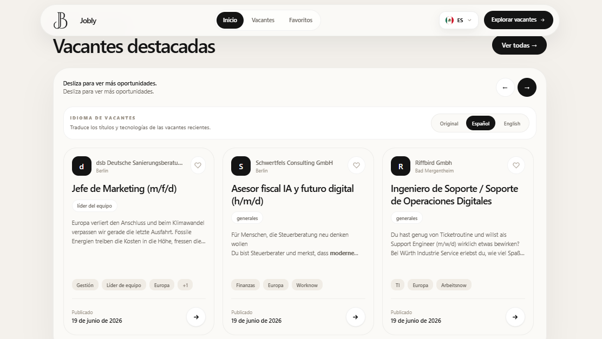
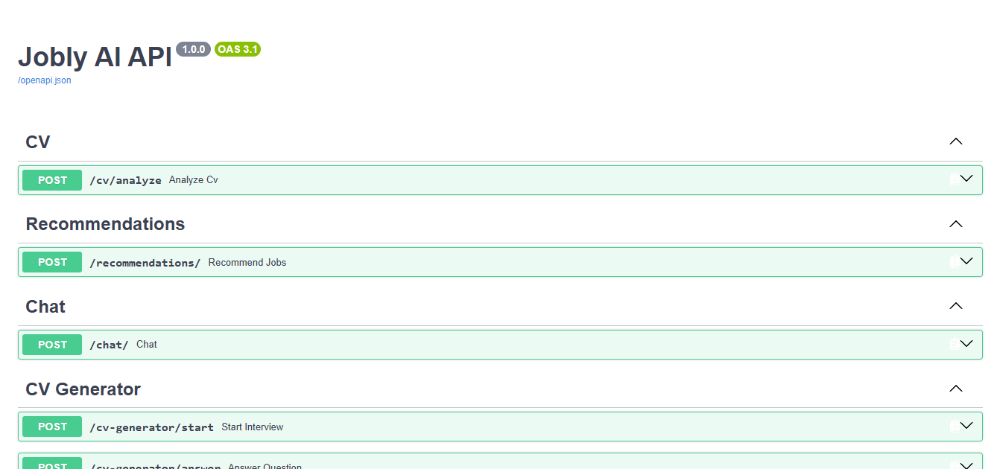

# TechHire

### Discover opportunities. Build your future.

<p align="center">
  
</p>

TechHire is a web platform designed to help students, developers, and technology professionals discover relevant job opportunities. It combines job search functionality with artificial intelligence to analyze a user's CV, identify professional skills, recommend potentially relevant opportunities, and provide conversational assistance.

The project was developed as a final project for Harvard University's CS50x 2026.

---

## About the Project

Finding a suitable technology job can require reviewing many listings and comparing their requirements with a candidate's skills and experience.

TechHire addresses this problem by bringing several related tasks into one platform. Users can search and filter job opportunities, save interesting listings as favorites, upload a CV in PDF format for analysis, review detected skills, receive job recommendations based on that profile, and interact with an AI assistant.

The application is designed around a simple workflow: discover opportunities, understand how a professional profile relates to them, and use an AI assistant for additional guidance about technology, programming, job searching, and professional development.

---

## Main Features

### Job Search

TechHire provides a job search experience for discovering available employment opportunities.

- Search for job opportunities.
- Filter job listings.
- View information about available positions.
- Support for remote, hybrid, and on-site opportunities when the source provides this information.
- Save interesting opportunities as favorites.
- View job details and requirements.

<p align="center">
  
</p>

### CV Analysis

Users can upload a CV in PDF format.

The backend receives the document and extracts its text using `pypdf`. The resulting information is processed to identify relevant professional and technical skills.

The detected skills can subsequently be used as context for job recommendations and the AI assistant.

### Job Recommendations

TechHire uses information obtained from CV analysis to identify job opportunities that may be relevant to the user's professional profile.

The recommendation flow uses detected skills together with information associated with available job listings to produce potentially relevant matches.

### AI Assistant

TechHire includes a conversational AI assistant that can help users with:

- Programming questions.
- Technology concepts.
- Job-search questions.
- Professional development.
- Questions related to detected CV skills.
- Questions about a selected job opportunity.

The assistant can respond in English or Spanish and can use relevant application context when available.

### Multilingual Interface

The user interface supports English and Spanish, allowing users to change the language of the application and interact with the AI assistant in either language.

---

## Technologies Used

| Technology | Purpose |
| --- | --- |
| Angular 17 | Frontend framework |
| TypeScript | Frontend application logic |
| RxJS | Reactive programming and asynchronous operations |
| Tailwind CSS | Interface styling |
| Python | Backend development |
| FastAPI | Backend REST API |
| pypdf | PDF text extraction |
| AI service | Conversational assistance and AI-powered processing |
| Job APIs | Job opportunity data |
| Vercel | Frontend deployment |
| Render | Backend deployment |

---

## Project Architecture

TechHire is organized into separate frontend and backend applications.

```text
techhire-cs50/
│
├── frontend/
│   ├── api/
│   ├── public/
│   │   ├── hero.png
│   │   ├── vacantes.png
│   │   └── API.png
│   ├── src/
│   │   └── app/
│   │       ├── core/
│   │       ├── models/
│   │       ├── pages/
│   │       ├── services/
│   │       └── shared/
│   ├── angular.json
│   ├── package.json
│   ├── package-lock.json
│   ├── tailwind.config.js
│   └── vercel.json
│
├── backend/
│   └── jobly-ai-api/
│       ├── app/
│       │   ├── generated_cv/
│       │   ├── models/
│       │   │   └── cv_models.py
│       │   ├── routers/
│       │   │   ├── chat.py
│       │   │   ├── cv_generator.py
│       │   │   ├── cv.py
│       │   │   └── recommendations.py
│       │   ├── services/
│       │   │   ├── chatbot/
│       │   │   ├── cv_builder_service.py
│       │   │   ├── gemini_service.py
│       │   │   ├── matching_service.py
│       │   │   └── pdf_service.py
│       │   ├── templates/
│       │   │   └── jobly_harvard_template.docxtpl.docx
│       │   ├── config.py
│       │   └── main.py
│       ├── README.md
│       └── requirements.txt
│
├── README.md
├── DESIGN.md
└── .gitignore
```

The frontend contains the Angular application, user interface, application pages, services, models, shared components, and public assets.

The backend is located in `backend/jobly-ai-api/` and provides the API used by the frontend.

### Backend Structure

The backend is organized into several components:

- `routers/` contains API routes for chat, CV processing, CV-related functionality, and job recommendations.
- `services/` contains application services for chatbot functionality, CV processing, Gemini integration, job matching, and PDF processing.
- `models/` contains backend data models.
- `templates/` contains the document template used by the CV-related functionality.
- `generated_cv/` contains generated CV-related files.
- `config.py` contains backend configuration.
- `main.py` is the backend application entry point.
- `requirements.txt` contains the Python dependencies required by the API.

### API Documentation

The backend is implemented as a REST API using FastAPI.

The project includes API documentation through FastAPI's OpenAPI support.

<p align="center">
  
</p>

---

## How It Works

The main application flow can be summarized as follows:

```text
User
 │
 ▼
Angular Frontend
 │
 ├── Search and filter jobs
 │
 ├── Save favorites
 │
 ├── Upload CV
 │       │
 │       ▼
 │   FastAPI Backend
 │       │
 │       ▼
 │   PDF Text Extraction
 │       │
 │       ▼
 │   Skill Detection
 │       │
 │       ▼
 │   Job Recommendations
 │
 └── AI Assistant
         │
         ▼
     FastAPI Backend
         │
         ▼
      AI Service
```

The Angular frontend communicates with the backend through HTTP requests.

For CV analysis, the PDF is sent to the backend, where its text is extracted and processed. The resulting skills can then be used when generating recommendations and when providing context to the AI assistant.

For the chat feature, the frontend sends the user's message and relevant context to the backend. The backend processes the request and returns the AI-assisted response to the frontend.

---

## Backend API

The backend is implemented as a REST API using FastAPI.

Its main responsibilities are:

### CV Analysis

The CV analysis functionality accepts a PDF file, extracts its text, and processes the document to identify relevant skills and professional information.

### Recommendations

The recommendation functionality receives profile information and job data and returns opportunities that may be relevant to the detected skills and requirements.

### Chat

The chat functionality receives a user's message and relevant context, such as detected CV skills or information about a selected job, and returns an AI-assisted response.

FastAPI provides OpenAPI documentation for the available API endpoints.

---

## Design Decisions

### Separation of Frontend and Backend

The frontend and backend are separated so that each layer has a clear responsibility.

Angular handles the user interface, navigation, job-search experience, CV upload, recommendations, favorites, language selection, and chat interface.

The backend handles document processing, recommendation requests, and communication with the AI service.

This separation makes the application easier to maintain and allows the frontend and backend to evolve independently.

### CV as Context

CV analysis was designed as part of a larger workflow rather than as an isolated feature.

The skills extracted from a CV can be reused as context for job recommendations and conversations with the AI assistant.

### Focused User Experience

The interface focuses on the primary objective of the platform: helping users discover employment opportunities and understand how those opportunities relate to their professional profile.

The application avoids unnecessary steps between searching for a position, analyzing a CV, receiving recommendations, and asking the assistant for guidance.

### Angular 17

The frontend uses Angular 17 as the framework version for this CS50x project. The repository keeps the Angular application compatible with the selected Angular 17 dependency set.

---

## Installation

### Prerequisites

The frontend requires Node.js and npm.

The backend requires Python and pip.

### Frontend

Clone the repository:

```bash
git clone https://github.com/Ezequie1Sc/techhire-cs50.git
```

Enter the frontend directory:

```bash
cd techhire-cs50/frontend
```

Install dependencies:

```bash
npm install
```

Start the Angular development server:

```bash
npm start
```

The application is normally available at:

```text
http://localhost:4200
```

### Backend

The backend source is located under:

```text
backend/jobly-ai-api/
```

Navigate to the backend project directory:

```bash
cd ../backend/jobly-ai-api
```

Create a Python virtual environment:

```bash
python -m venv venv
```

Activate it on Windows:

```bash
venv\Scripts\activate
```

Install the backend dependencies:

```bash
pip install -r requirements.txt
```

Start the API using the entry point and configuration provided by the backend project.

---

## Deployment

The frontend is deployed using Vercel.

The backend API is deployed using Render.

The production frontend communicates with the deployed backend through HTTP requests.

### Live Application

https://techhire-cs50.vercel.app

### Backend API

https://jobly-ai-api.onrender.com

---

## Demo

### Live Application

https://techhire-cs50.vercel.app

### GitHub Repository

https://github.com/Ezequie1Sc/techhire-cs50

### Project Video

https://youtu.be/_mkmxHbk8LA

The project video is a short demonstration of TechHire and its main functionality.

---

## AI Usage

Artificial intelligence tools were used during the development process as development assistance.

AI assistance was used for activities such as:

- Exploring implementation approaches.
- Debugging and understanding errors.
- Reviewing and improving parts of the user interface.
- Reviewing code structure.
- Assisting with the implementation and refinement of the conversational assistant.
- Reviewing and improving project documentation.

The project author remained responsible for the final application, architecture, integration, functionality, testing, and implementation decisions.

Where AI-assisted code was used, the relevant code comments identify that assistance as required by the CS50x final project instructions.

---

## Future Improvements

Possible future improvements include:

- More advanced job recommendation algorithms.
- Additional job sources.
- More detailed CV analysis.
- Improved matching between job requirements and candidate skills.
- Interview preparation features.
- Additional languages.
- User accounts and persistent profiles.
- More personalized career recommendations.

---

## Author

**Orlando Ezequiel Salazar Cruz**

Computer Systems Engineering Student  
Software Developer

GitHub:

https://github.com/Ezequie1Sc

LinkedIn:

https://www.linkedin.com/in/ezequiel-salazar-194975340/

---

## License

This project is distributed under the MIT License.

---

### TechHire — Connecting talent with opportunities.
